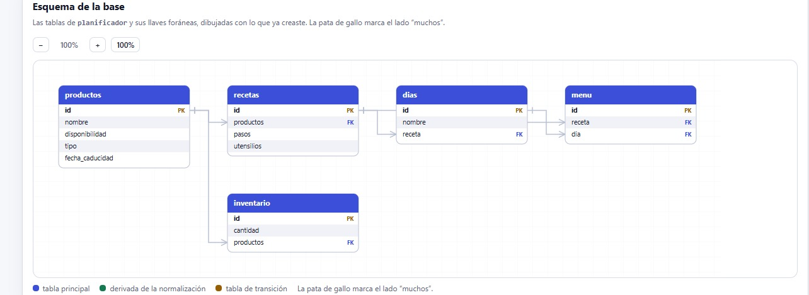

# Proyecto Integrador 

Este repositoriocontiene los aportes del grupo 5 de desarrollo de sotware CESDE/NUTRESA que se encarga del Planificador de Menús y Lista de Mercado con inspiración del proyecto (https://sazon-ten.vercel.app/).

# Tecnologia y Requisitos
* Motor: Postgresql

# Modelo Entidad-Relación

* Nota: Si editas el diagrama, asegúrate de actualizar esta imagen y exportar el archivo fuente en la carpeta

# Configuración inicial:
* Clonar el repositorio: (https://github.com/dexter-mouser/proyecto-integrador)
* 
* 
# Diccionario de Tablas Principales
* 
* 
* 

# Reglas Colaboración

Para evitar conflictos se establece: 
* NOMBRES SQL: Usa "Snake_case" para losnombres de las tablas y columnas [👍🏿fecha_caducidad]
* CONVENCIONAL COMMITS: Para la aceptación se debe de enviar el commit desde la rama "devlop + nombre integrante" y el comentario debe tener un acronimo junto a una corta explicación. [👍🏿(feat: Una nueva funcionalidad), (fix: Una corrección), (docs: Cambios exclusivos en la documentación), (refactor: Refactorización de codigo)] [https://www.conventionalcommits.org/es/v1.0.0-beta.3/].
* 
* 
